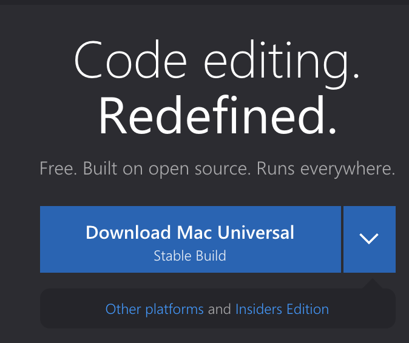
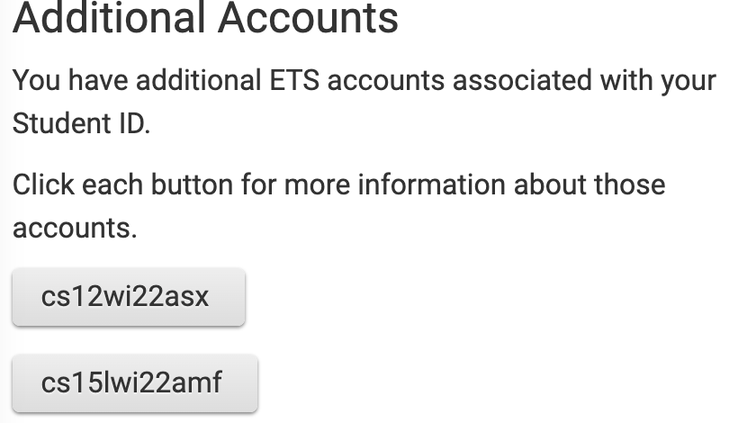
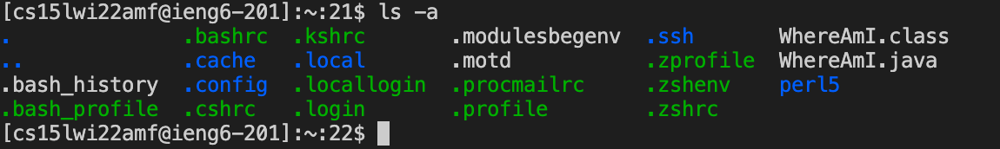
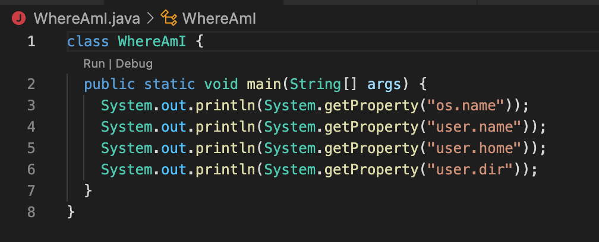
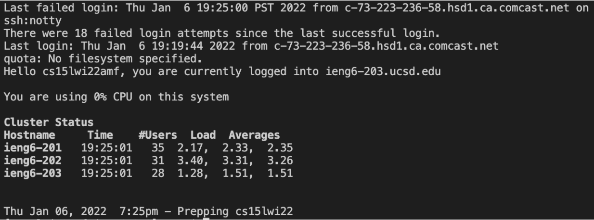

# Installing VScode

* Go to [this link](https://code.visualstudio.com/)
* Follow prompts to install VScode onto your device
# Remotely Connecting
* If you are on Windows, you must first [install OpenSSH](https://docs.microsoft.com/en-us/windows-server/administration/openssh/openssh_install_firstuse)
* Find your course-specific account for CSE 15L [here](https://sdacs.ucsd.edu/~icc/index.php)

* Open a terminal in VSCode, and type in this command, responding appropriately to all prompts that follow
> ssh *(your account username here)*@ieng6.ucsd.edu
# Trying Some Commands
* Play around with some commands, like "cd ~" and "ls -a"

* To log out, hit Ctrl+D and run the command "exit"
# Moving Files with scp
* Create a file on your device called "WhereAmI.java, put these contents into it, then run it with "javac" and "java"

* Run this following command 
> scp WhereAmI.java *(your account username here)*@ieng6.ucsd.edu
# Setting an SSH key
* Run "ssh-keygen" (if you're on Windows, also follow [these instructions](https://docs.microsoft.com/en-us/windows-server/administration/openssh/openssh_keymanagement#user-key-generation))
* While on the server, run "mkdir ..sh", then "scp *(the location of your public key) (your account username here)*@ieng6.ucsd.edu

* Note: this may take many tries
# Optimizing Remote Running
* Use semicolons to run multiple commands on the same line

* Use the up arrow to recall the last command that was run