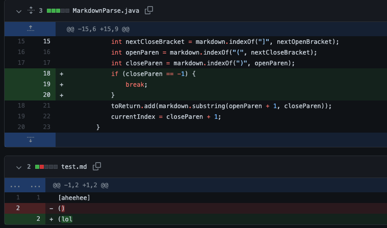
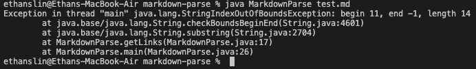
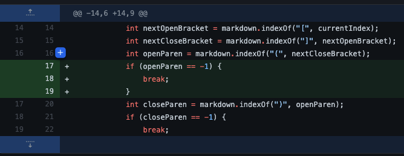
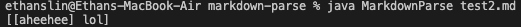
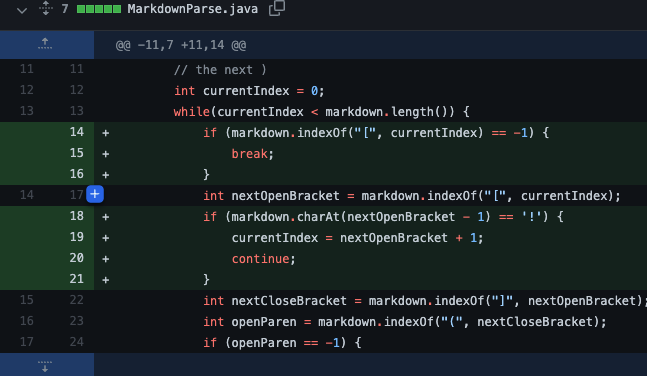
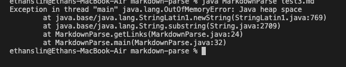

*Code Change 1:*

[Test File](https://github.com/EthanSLin/markdown-parse/blob/main/test.md)

When an link without a closed parentheses is inserted, the program becomes confused and throws an exception, unable to proceed. The program looks for the index of the next ')', but since there aren't any, an IndexOutOfBoundsException is thrown.

*Code Change 2:*

[Test File](https://github.com/EthanSLin/markdown-parse/blob/main/test2.md
)

When an link with only a closed parentheses is inserted, the program becomes confused and interprets the previous text as being part of the link. The program looks for the index of an '(', but since there aren't any, the substring it obtains is from index 0 to the index of closeParens

*Code Change 3*

[Test File](https://github.com/EthanSLin/markdown-parse/blob/main/test3.md)

When a link is inserted with !`[Image]` in front of it, instead of `[(text)]`, the program becomes confused and locks into an infinite loop, eventually showing an error. The program looks for the index of an '[', but since the '[' isn't at index 0 like it usually is and  `currentIndex` is uanble to iterate forward in `markdown`, it continues running in place and eventualy causing an OutOfMemoryError