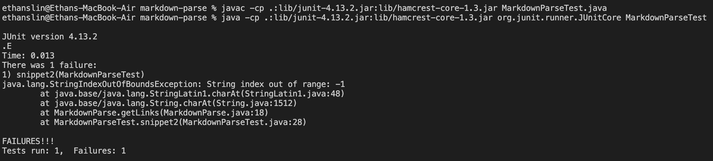

[My Repository](https://github.com/EthanSLin/markdown-parse)
[Reviewed Repository](https://github.com/ezhou413/markdown-parse)

For the first snippet, I can make it work with a small code change. I simply need to add some variables and conditional loops to check if a backtick pair overlaps with the square bracket pair

For the second snippet, I can make it work with a small code change. Since the error is thrown because it attempts the check the character at an index of -1, I just need to put a conditional to make sure it doesn't check that if [ is at index 0.

For the third snippet, I can make it work with a small code change. Since the error is thrown because it attempts the check the character at an index of -1, I just need to put a conditional to make sure it doesn't check that if [ is at index 0.