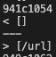
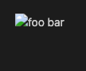
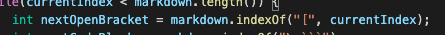
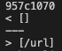
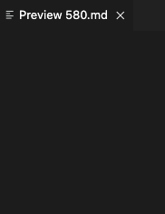

To find the tests with different results, I used diff on the results of running a bash for loop on the two MarkdownParse implementations.

For test 573, my implementation provided the correct output, while Joe's did not.
Here is the correct output

The issue with Joe's implementation is that it does not check if an instance of "[" has an exclamation mark in front of it, so it will always think images are actually links, which is what happened here.

To fix this bug, the implementation should check if the character preceding "[" is an exclamation mark or not.

For test 580, my implementation provided the correct output, while Joe's did not.
Here is the correct output

The issue with Joe's implementation is that it does not check if an instance of "[" has an exclamation mark in front of it, so it will always think images are actually links, which is what happened here. Additionally, it does not check if there is any text between the two brackets

To fix this bug, the implementation should check if the character preceding "[" is an exclamation mark or not. In addition, the implementation should check if there is any text between the two brackets